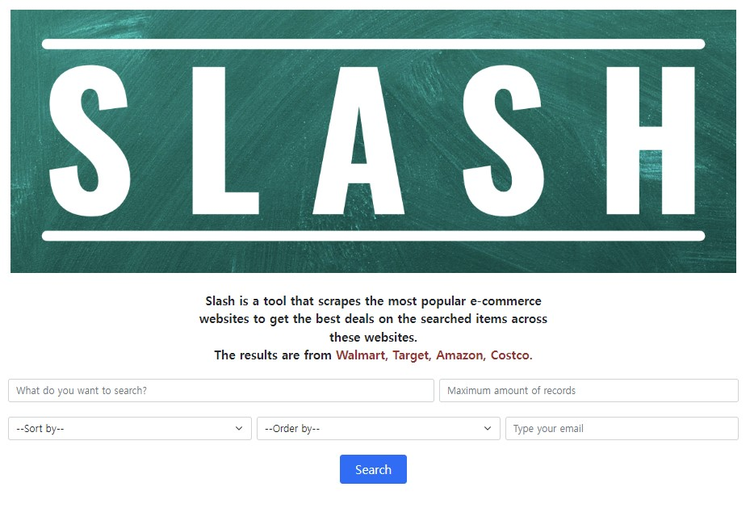
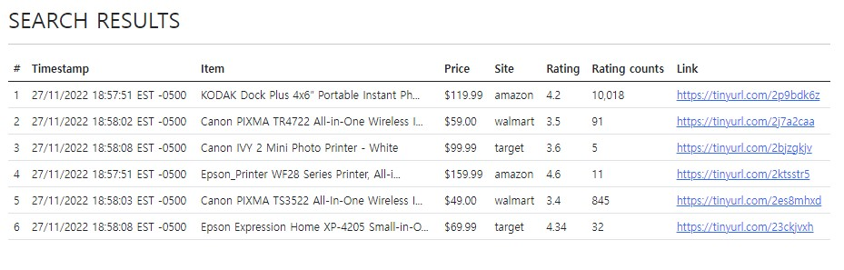

**This is a cloned project of `https://github.com/vishnuchalla/slash`**

<p align="center"></p>

**Shopping Made Easy**


 
[](https://doi.org/10.5281/zenodo.7369909)


[](https://codecov.io/github/spark1217/slash-group32)  
  
Slash is a website that scrapes the most popular e-commerce websites to get the best deals on the searched items across these websites. 
- **Fast**: With slash, you can save over 50% of your time by comparing deals across websites within seconds
- **Easy**: Slash uses very easy commands to filter, sort and search your items
- **Powerful**: Quickly alter the commands to get desired results
- **Informative**: Provides the information about items through an email with attached csv file

<ul align="left">
  
  <li> <a href="#rocket-installation">Installation</a> </li>
  
  <li> <a href="#golf-flags-and-command-line-arguments">Flags & Args</a> </li>
  
  <li><a href="#card_index_dividers-some-examples">Examples</a></li>
  
  <li><a href="#thought_balloon-use-case">Use Case</a></li>
  
  <li><a href="#page_facing_up-why">Why</a></li>
  
  <li><a href="#sparkles-contributors">Contributors</a></li>
  
  <li><a href="#email-support">Support</a></li>
  
</ul>

Video Walkthrough (Click on the image below)

[](https://www.youtube.com/watch?v=5rhigwURrYY "Introducing Slash")


---

:rocket: Installation
---
1. Clone the Github repository to a desired location on your computer. You will need [git](https://git-scm.com/) to be preinstalled on your machine. Once the repository is cloned, you will then ```cd``` into the local repository.
```
git clone https://github.com/spark1217/slash-group32/
cd slash
```
2. This project uses Python 3, so make sure that [Python](https://www.python.org/downloads/) and [Pip](https://pip.pypa.io/en/stable/installation/) are preinstalled. All requirements of the project are listed in the ```requirements.txt``` file. Use pip to install all of those.
```
pip3 install -r requirements.txt
```
3. Once all the requirements are installed, you will have to ```cd``` into the ```src``` folder. Once in the ```src``` folder, use the python command to run the ```slash.py``` file.
```
cd src

For Mac
python3 browser.py

For Windows
python browser.py
```
Then open [http://127.0.0.1:5000/](http://127.0.0.1:5000/)  

:golf: Flags and Command Line Arguments
---
Currently the tool supports the following flags and command line arguments. These flags and arguments can be used to quickly filter and guide the search to get you the best results very quickly.

| Text field | Type | Default | Description                                                          |
|-----------|------|---------|----------------------------------------------------------------------|
| search  | str  | None    | The product name to be used as the search query                      |
| Maximum amount of records     | int  | 3       | Maximum number of products to search                                 |
| sort by    | dropdown  | relevance      | Sort results by relevance (re), by price (pr), by rating (ra) or by all the features using "all" this sorts in the order of price and ratings in the respective order|
| Order by     | dropdown | Ascending      | Set a flag if results should be sorted in non-increasing order, the default value is ascending |
| Email   | str  | "" (empty) | list of comma separated emails to send notifications |

:card_index_dividers: Some Examples
--- 
<p align="center"></p>

#### 1. Searching
```Search```  accepts one argument string which it uses to search and scrape the requested products on 
the e-commerce websites. This field must be filled.  
  
#### 2. Sorting
```Sort by``` accepts one arguments that determine how the tool sorts and filters the requested products
after scraping. This field is optional. The default value when nothing is selected is ```relevance```.  
  
#### 3. Sort Order
```Order by``` flag can be set to sort the requested products in a non-increasing order. The default value taken is ```Ascending```.   

#### 4. Result length
The maximum number of results that are scraped from each website can be set. It accepts
an integer value ```n``` and then returns ```n``` results from each website. Note that tool returns a maximum of 
the value of ```n``` and the number of results on the webiste. By default this value is set to 3 if user doesn't fill the field.  
  
#### 5. Link
The results display links by default.  
  
#### 6. Email Notification
There is an option to send emails to customers using a parameter that accepts a comma separated list of emails. The field can be empty.   
  
#### Sample output  
<p align="center"></p>
  

:thought_balloon: Use Case
---
* ***Students***: Students coming to university are generally on a budget and time constraint and generally spend hours wasting time to search for products on Websites. Slash is the perfect tool for these students that slashes all the unnecessary details on a website and helps them get prices for a product across multiple websites.Make the most of this tool in the upcoming Black Friday Sale.
* ***Data Analysts***: Finding data for any project is one of the most tedious job for a data analyst, and the datasets found might not be the most recent one. Using slash, they can create their own dataset in real time and format it as per their needs so that they can focus on what is actually inportant.
* ***Customers***: Can be used by customers to simply query for the items and get a email on the details.

:page_facing_up: Why
---
- In a market where we are spoilt for choices, we often look for the best deals.  
- The ubiquity of internet access has leveled the retail playing field, making it easy for individuals and businesses to sell products without geographic limitation. In 2020, U.S. e-commerce sales, receiving a boost due to the COVID-19 pandemic, grew 44% and represented more than 21% of total retail sales, according to e-commerce information source Internet Retailer.
- The growth of e-commerce has not only changed the way customers shop, but also their expectations of how brands approach customer service, personalize communications, and provide customers choices.
- E-commerce market has prompted cut throat competition amongst dealers, which is discernable through the price patterns for products of major market players. Price cuts are somewhat of a norm now and getting the best deal for your money can sometimes be a hassle (even while online shopping).
- This is what Slash aims to reduce by giving you an easy to use, all in one place solution for finding the best deals for your products that major market dealers have to offer!
- Slash in its current form is for people who have some understanding of python and are comfortable in using the command line interface to interact with systems.
- Future updates aim to encompass a wide variety of users irrespective of their computer knowledge and background.

:open_file_folder: Document Generated
---
To have a better understanding of the code, please click on the [link](https://spark1217.github.io/slash-group32/src/index.html) provided below.

[Github Pages](https://spark1217.github.io/slash-group32/src/index.html)
  

:sparkles: Contributors
---

| [Seoyeong Park](https://github.com/spark1217)  
| [Chris Kastritis](https://github.com/Chris-Kastritis)  
| [Safaa Mohamed](https://github.com/Safaa26)  
| [Collin Riggs](https://github.com/CMRiggs)  
| [Soham Bapat](https://github.com/sohambapat)  

:email: Support
---

For any queries and help, please reach out to us at: spark43@ncsu.edu
